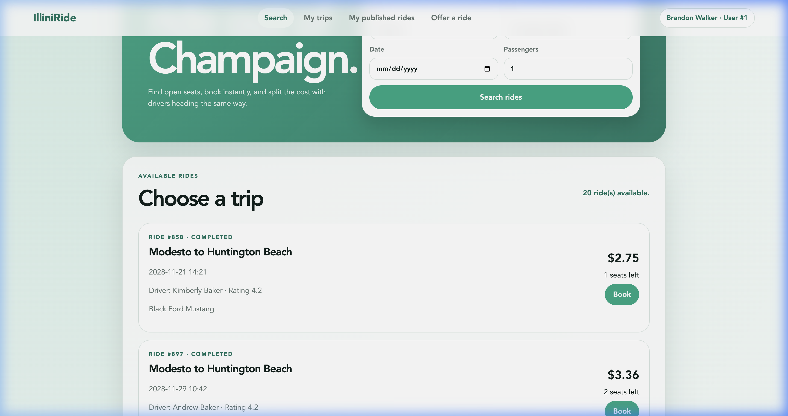
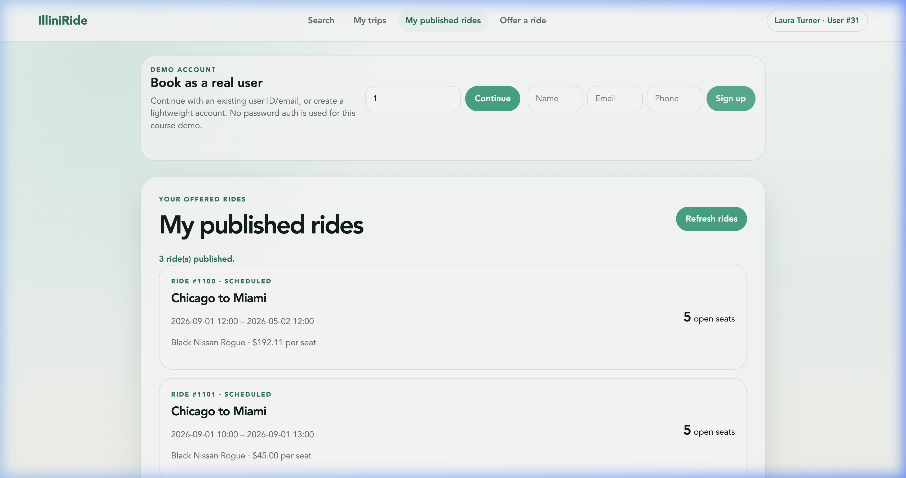
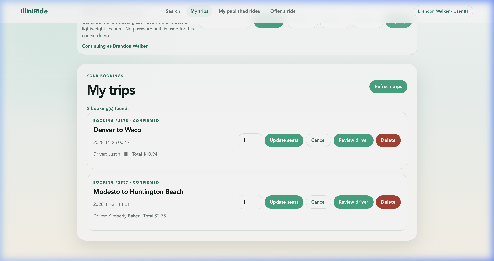

# 🚗 IlliniRide — Campus Carpooling Platform

[](https://nodejs.org/)
[](https://www.mysql.com/)
[](https://cs.illinois.edu/)
[]()

> **IlliniRide** is a campus carpooling web platform designed for the UIUC community. It connects student drivers heading out of campus (e.g., to Chicago, O'Hare Airport, suburbs) with riders traveling the same route to share rides, split travel costs, and reduce commuting friction.

---

## 📌 Table of Contents
- [Overview & Motivation](#-overview--motivation)
- [Application Screenshots](#-application-screenshots)
- [Key Features](#-key-features)
- [Database Architecture & Advanced Programs](#-database-architecture--advanced-programs)
- [Tech Stack](#-tech-stack)
- [Repository Structure](#-repository-structure)
- [Getting Started & Local Setup](#-getting-started--local-setup)
  - [Prerequisites](#prerequisites)
  - [Step 1: Install & Start MySQL](#step-1-install--start-mysql)
  - [Step 2: Database Initialization](#step-2-database-initialization)
  - [Step 3: Start the Web Application](#step-3-start-the-web-application)
- [Demo Walkthrough](#-demo-walkthrough)
- [Verification & Testing](#-verification--testing)
- [Team Information](#-team-information)

---

## 💡 Overview & Motivation

Commuting between the UIUC campus and major hubs like Chicago or O'Hare (ORD) is a recurring challenge for students and faculty. Solo rideshares are expensive and public transit schedules can be rigid.

**IlliniRide** bridges this gap by allowing student drivers to post available seats with intelligent dynamic pricing, while riders can easily search, compare, and instantly book seats.

---

## 📸 Application Screenshots

### 1. Ride Search & Availability
Search for available campus carpools by origin, destination city, date, and seat count:


### 2. Offer a Ride & Dynamic Price Calculation
Drivers can publish rides with automated distance-based suggested pricing powered by MySQL stored procedures:


### 3. Trips & Bookings Management
Manage bookings with transaction safety and live status updates:


---

## ✨ Key Features

- 🔍 **Keyword Search & Live Availability:** Search available rides by origin and destination city with real-time seat availability checks.
- 🏷️ **Dynamic Price Suggestion:** Stored procedure calculates geospatial distance between cities to suggest fair base prices.
- 🛡️ **Safe Seat Booking (ACID):** Stored procedure with serializable transaction isolation prevents overbooking and duplicate reservations.
- 📋 **Full CRUD Operations:** Complete management for Bookings and Rides with raw SQL execution (zero ORM overhead).
- ⭐ **Automated Rating System:** Database trigger automatically recalculates user ratings whenever new reviews are submitted.

---

## 🗄️ Database Architecture & Advanced Programs

The database schema models six core relational entities: `Users`, `Vehicles`, `Cities`, `Rides`, `Bookings`, and `Reviews`.

### Advanced Database Programs (`doc/stage4_advanced_database_programs.sql`)
1. **`sp_post_ride_with_suggested_price` (Stored Procedure):**
   Calculates coordinate distance between origin and destination cities and applies a base pricing formula to recommend a ride price.
2. **`sp_book_ride_transaction` (Transaction):**
   Executes booking creation inside a serializable transaction block, verifying vehicle seat capacity and preventing duplicate bookings.
3. **`trg_reviews_after_insert_update_user_rating` (Trigger):**
   Fires automatically upon review insertion to recompute the reviewee's aggregate average rating in the `Users` table.

---

## 🛠️ Tech Stack

- **Frontend:** Vanilla HTML5, CSS3 (Modern Responsive UI), Vanilla JavaScript
- **Backend:** Node.js (`http`, `child_process` raw SQL execution)
- **Database:** MySQL 8.0+
- **Data Pipeline:** Cleaned CSV datasets with enforced referential integrity

---

## 📁 Repository Structure

```text
IlliniRide/
├── app/
│   ├── public/
│   │   ├── index.html        # Web application interface
│   │   ├── styles.css        # UI styling & layout
│   │   └── app.js            # Client-side logic & API calls
│   └── server.js             # Node.js backend server (Raw SQL client)
├── data/                     # Cleaned CSV datasets (Users, Rides, Bookings, Cities, etc.)
├── doc/
│   ├── screenshots/          # Application UI screenshots
│   │   ├── search_rides.png
│   │   ├── offer_ride.png
│   │   └── my_trips.png
│   ├── stage4_advanced_database_programs.sql # Stored procedures, triggers & transactions
│   ├── stage4_project_report.md              # Stage 4 reflection report
│   ├── stage1_proposal.md                    # Project proposal
│   └── stage2_database_design.md             # Schema & ER diagram
├── TeamInfo.md               # Team roster and project submission links
├── package.json
└── README.md
```

---

## 🚀 Getting Started & Local Setup

### Prerequisites
- **[Node.js](https://nodejs.org/)** (v16.0 or higher)
- **[MySQL Server & CLI Client](https://dev.mysql.com/downloads/mysql/)** (v8.0 or higher)

---

### Step 1: Install & Start MySQL

Ensure MySQL Server is installed and the `mysql` command-line tool is available in your `PATH`.

- **macOS (Homebrew):**
  ```bash
  brew install mysql
  brew services start mysql
  ```

- **Ubuntu / Debian Linux:**
  ```bash
  sudo apt update
  sudo apt install mysql-server
  sudo systemctl start mysql
  ```

- **Windows:**
  Install MySQL via the [MySQL Installer](https://dev.mysql.com/downloads/installer/) and ensure the `bin/` directory is added to your System `PATH`.

---

### Step 2: Database Initialization & Data Loading

1. Create the `illiniride` database and schema tables:
   ```bash
   mysql -u root -p -e "CREATE DATABASE IF NOT EXISTS illiniride;"
   ```
   *(If your local root account has no password, omit `-p`)*

2. Populate the tables with the CSV data files:
   ```bash
   npm run import-data
   ```

3. Apply the Stage 4 advanced database routines (stored procedures, triggers, and transactions):
   ```bash
   mysql --protocol=TCP -h 127.0.0.1 -P 3306 -u root -p illiniride < doc/stage4_advanced_database_programs.sql
   ```

---

### Step 3: Start the Web Application

The backend server communicates directly with MySQL using environment variables.

| Variable | Default Value | Description |
| :--- | :--- | :--- |
| `DB_HOST` | `127.0.0.1` | MySQL server host |
| `DB_PORT` | `3306` | MySQL server port |
| `DB_USER` | `root` | Database username |
| `DB_PASSWORD` | `""` *(empty)* | Database password |
| `DB_NAME` | `illiniride` | Target database name |
| `PORT` | `3000` | Web application port |

Start the server:

```bash
# Standard launch:
npm start

# Or with custom credentials:
DB_HOST=127.0.0.1 DB_PORT=3306 DB_USER=root DB_PASSWORD=your_password DB_NAME=illiniride npm start
```

Open your browser and navigate to: **`http://localhost:3000`**

---

## 🎬 Demo Walkthrough

1. **Search Rides:** Search from `Modesto` to `Huntington Beach` to test live availability filtering.
2. **Post Ride:** Offer a ride to trigger `sp_post_ride_with_suggested_price` and view the dynamically calculated suggested price.
3. **Create Booking:** Book seats on an available ride to execute the serializable transaction `sp_book_ride_transaction`.
4. **View & Manage Bookings:** Read joined bookings with rider/driver info, update seat counts, and verify price recalculation.
5. **Submit Review:** Add a review and verify that the trigger `trg_reviews_after_insert_update_user_rating` automatically updates the user's aggregate rating.

---

## 🧪 Verification & Testing

Verify JavaScript code syntax:
```bash
node --check app/server.js
node --check app/public/app.js
```

Verify that advanced database objects exist in MySQL:
```sql
SELECT ROUTINE_NAME, ROUTINE_TYPE
FROM information_schema.ROUTINES
WHERE ROUTINE_SCHEMA = 'illiniride';

SELECT TRIGGER_NAME, EVENT_MANIPULATION, EVENT_OBJECT_TABLE
FROM information_schema.TRIGGERS
WHERE TRIGGER_SCHEMA = 'illiniride';
```

---

## 👥 Team Information (Team-040 — YAY)

| Role | Name | NetID / Email |
| :--- | :--- | :--- |
| **Captain** | Steve Aby Tonio | `stonio2@illinois.edu` |
| **Member 1** | Harshita Ketharaman | `hk76@illinois.edu` |
| **Member 2** | Keshav Rampratap Soni | `krsoni2@illinois.edu` |

*Developed for UIUC CS 411 (Database Systems).*
