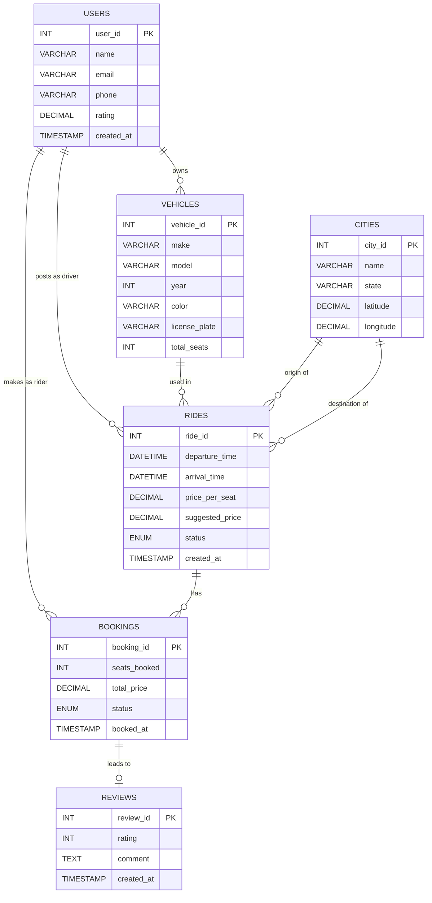

# IlliniRide: Conceptual and Logical Database Design (Stage 2)

---

## Entity-Relationship Diagram




---

## Entity Descriptions and Assumptions

### 1. USERS
Represents any registered person on the platform. A user can act as a driver (by posting rides) or a rider (by booking rides) at different times, so we do not split them into two separate entities. This keeps the schema clean and avoids data duplication.

- `rating` stores the user's average rating across all reviews they have received (as either driver or rider). This is a derived value updated after each review is submitted.
- `email` is unique per user and used as the login identifier.
- We assume every user must register before posting or booking a ride.

### 2. VEHICLES
Represents a car registered by a user for use in rides. We model this as a separate entity (rather than attributes on USERS) because a single user can own multiple vehicles and may choose different vehicles for different rides. Storing vehicle info directly on the user would not support this.

- A vehicle must be linked to exactly one user (its owner).
- `total_seats` represents the physical capacity of the car, which sets an upper bound on seats available for any ride using that vehicle.
- We assume a vehicle can only be owned by one user (no shared ownership).

### 3. CITIES
Represents a real-world city with geographic coordinates. This is populated from the US Cities dataset (simplemaps.com) with 1000+ entries. We model this as its own entity rather than storing city names as plain strings in RIDES because:
- It standardizes input (no typos like "Chcago" vs "Chicago")
- It stores latitude and longitude which drives the dynamic price suggestion feature
- It enables future analytics like most popular routes

- A city can appear as origin or destination in many rides.
- We assume the dataset covers all cities relevant to UIUC carpooling (Midwest focus).

> **Note:** For the scope of this database project, we have chosen to store city coordinates in this table and compute distances using the Haversine formula through database queries, keeping the creative component fully database-driven. The architecture is intentionally designed so that a third-party API like Google Maps or OSRM can be swapped in later for more precise driving distances without any schema changes.

### 4. RIDES
Represents a single carpool trip posted by a driver. This is the central entity of the application. We separate it from USERS and VEHICLES because a ride has its own lifecycle (scheduled, ongoing, completed, cancelled) and its own attributes independent of the driver or car.

- A ride has exactly one driver, one vehicle, one origin city, and one destination city.
- `suggested_price` is computed at ride creation time using the Haversine formula on the origin and destination city coordinates and stored for reference.
- `price_per_seat` is set by the driver and may differ from `suggested_price`.
- Available seats are NOT stored directly. They are computed as: `total_seats - SUM(seats_booked)` from active bookings. This avoids inconsistency.
- We assume a driver cannot book their own ride.

### 5. BOOKINGS
Represents a rider reserving one or more seats on a ride. We model this as its own entity because it is the link between a rider (USERS) and a ride (RIDES), and it carries its own data: how many seats were booked, total price paid, and booking status. This is effectively the resolution of the many-to-many relationship between USERS and RIDES.

- One booking belongs to exactly one ride and one rider.
- `total_price` is stored as `seats_booked * price_per_seat` at time of booking. We store this redundantly to protect against price changes after booking.
- Booking confirmation is instant (no driver approval required).
- A rider can have multiple bookings across different rides.

### 6. REVIEWS
Represents a rating and comment left by one user about another after a completed ride. We tie reviews to bookings (not directly to rides or users) to enforce that a review can only be written if a booking actually took place. Both the driver reviewing a rider and the rider reviewing a driver are captured in the same table using `reviewer_id` and `reviewee_id`.

- Each booking can produce at most two reviews (driver reviews rider, rider reviews driver).
- `rating` is constrained between 1 and 5.
- We assume reviews can only be submitted after the ride status is marked as completed.

---

## Relationship Descriptions and Cardinality

| Relationship | Type | Description |
|---|---|---|
| USERS owns VEHICLES | 1-to-Many | One user can register multiple vehicles. Each vehicle belongs to exactly one user. |
| USERS posts RIDES | 1-to-Many | One user (as driver) can post many rides. Each ride has exactly one driver. |
| USERS makes BOOKINGS | 1-to-Many | One user (as rider) can make many bookings. Each booking belongs to exactly one rider. |
| VEHICLES used in RIDES | 1-to-Many | One vehicle can be used in many rides. Each ride uses exactly one vehicle. |
| CITIES origin of RIDES | 1-to-Many | One city can be the origin of many rides. Each ride has exactly one origin city. |
| CITIES destination of RIDES | 1-to-Many | One city can be the destination of many rides. Each ride has exactly one destination city. |
| RIDES has BOOKINGS | 1-to-Many | One ride can have many bookings. Each booking belongs to exactly one ride. |
| BOOKINGS leads to REVIEWS | 1-to-One (optional) | One booking can lead to at most one review per direction (rider->driver, driver->rider). Modeled as optional since not every booking results in a review. |

**Many-to-Many relationship:** USERS and RIDES share an implicit many-to-many relationship (a user can book many rides, a ride can be booked by many users). This is resolved through the BOOKINGS entity which acts as the junction table.

---

## Normalization

We apply **BCNF (Boyce-Codd Normal Form)** to all tables. A table is in BCNF if for every non-trivial functional dependency X → Y, X is a superkey of the table.

### USERS
Functional dependencies: `user_id → name, email, phone, rating, created_at`  
`email` is also a candidate key: `email → user_id, name, phone, rating, created_at`  
All FDs have a superkey on the left. **BCNF satisfied.**

### VEHICLES
Functional dependencies: `vehicle_id → user_id, make, model, year, color, license_plate, total_seats`  
`license_plate` is also a candidate key.  
All FDs have a superkey on the left. **BCNF satisfied.**

### CITIES
Functional dependencies: `city_id → name, state, latitude, longitude`  
`(name, state)` is also a candidate key (a city name is unique within a state).  
All FDs have a superkey on the left. **BCNF satisfied.**

### RIDES
Functional dependencies: `ride_id → driver_id, vehicle_id, origin_city_id, destination_city_id, departure_time, arrival_time, price_per_seat, suggested_price, status, created_at`  
No non-key attribute determines another non-key attribute. **BCNF satisfied.**

### BOOKINGS
Functional dependencies: `booking_id → ride_id, rider_id, seats_booked, total_price, status, booked_at`  
`total_price` is functionally dependent on `seats_booked * price_per_seat`, but `price_per_seat` is not stored in this table (it is stored in RIDES). Since we store `total_price` as a snapshot at booking time, this is a deliberate denormalization to protect historical accuracy. **BCNF satisfied.**

### REVIEWS
Functional dependencies: `review_id → booking_id, reviewer_id, reviewee_id, rating, comment, created_at`  
All FDs have a superkey on the left. **BCNF satisfied.**

All six tables are in BCNF. No decomposition was necessary.

---

## Relational Schema

```
Users(
  user_id: INT [PK],
  name: VARCHAR(100),
  email: VARCHAR(100),
  phone: VARCHAR(15),
  rating: DECIMAL(2,1),
  created_at: TIMESTAMP
)

Vehicles(
  vehicle_id: INT [PK],
  user_id: INT [FK to Users.user_id],
  make: VARCHAR(50),
  model: VARCHAR(50),
  year: INT,
  color: VARCHAR(30),
  license_plate: VARCHAR(15),
  total_seats: INT
)

Cities(
  city_id: INT [PK],
  name: VARCHAR(100),
  state: VARCHAR(50),
  latitude: DECIMAL(9,6),
  longitude: DECIMAL(9,6)
)

Rides(
  ride_id: INT [PK],
  driver_id: INT [FK to Users.user_id],
  vehicle_id: INT [FK to Vehicles.vehicle_id],
  origin_city_id: INT [FK to Cities.city_id],
  destination_city_id: INT [FK to Cities.city_id],
  departure_time: DATETIME,
  arrival_time: DATETIME,
  price_per_seat: DECIMAL(6,2),
  suggested_price: DECIMAL(6,2),
  status: ENUM('scheduled','ongoing','completed','cancelled'),
  created_at: TIMESTAMP
)

Bookings(
  booking_id: INT [PK],
  ride_id: INT [FK to Rides.ride_id],
  rider_id: INT [FK to Users.user_id],
  seats_booked: INT,
  total_price: DECIMAL(6,2),
  status: ENUM('confirmed','cancelled'),
  booked_at: TIMESTAMP
)

Reviews(
  review_id: INT [PK],
  booking_id: INT [FK to Bookings.booking_id],
  reviewer_id: INT [FK to Users.user_id],
  reviewee_id: INT [FK to Users.user_id],
  rating: INT,
  comment: TEXT,
  created_at: TIMESTAMP
)
```

---

*Team: YAY | Keshav Soni, Steve Aby Tonio, Harshita Ketharaman*  
*Course: CS 411 - Database Systems, UIUC*
